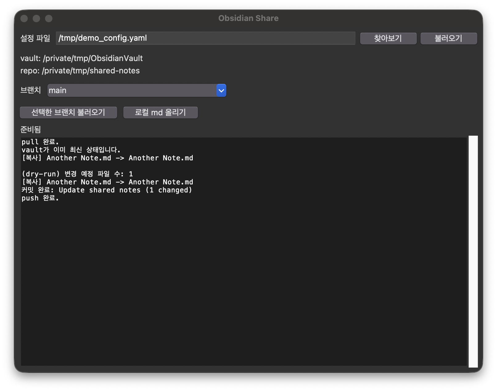

# Share Obsidian

개인 Obsidian vault에서 `share: true`로 표시한 노트만 골라 GitHub 레포로 동기화하는 작은 도구입니다. CLI와 Tkinter GUI를 둘 다 제공합니다.



## 특징

- 프론트매터 `share: true` 태그가 붙은 노트만 선택적으로 공유
- 위키링크(`[[노트]]`)·임베드(`![[이미지]]`) 문법을 변환 없이 그대로 유지
- 노트에서 참조하는 이미지도 자동으로 함께 동기화
- 태그를 떼거나 vault에서 노트를 지우면 레포에서도 자동 제거 (매니페스트 기반 동기화)
- vault별로 브랜치를 분리해서 여러 vault를 하나의 레포로 관리 가능
- 레포 → vault 역방향 가져오기 지원 (다른 기기에서 이어서 작업)
- Windows용 단일 exe로 빌드 가능 (PyInstaller)

## 요구 사항

- Python 3.9+
- [Git](https://git-scm.com/) (PATH에 등록되어 있어야 함)
- `pip install pyyaml`

## 사용법

1. GitHub에 공유용 레포를 만들고 로컬에 `git clone`
2. `config.example.yml`을 `config.yaml`로 복사한 뒤 `vault_path`, `repo_path` 등을 채움
   (Windows 경로는 `C:/Users/me/vault`처럼 슬래시를 사용하세요)
3. 공유하고 싶은 노트의 프론트매터에 태그 추가:
   ```yaml
   ---
   share: true
   ---
   ```
4. 실행:
   ```bash
   python3 obsidian_share.py -c config.yaml --dry-run   # 변경 사항 미리보기
   python3 obsidian_share.py -c config.yaml             # 복사 + commit + push
   python3 obsidian_share.py -c config.yaml --pull      # 레포 -> vault 가져오기
   ```
   또는 GUI로:
   ```bash
   python3 obsidian_share_gui.py
   ```

## 여러 vault, 하나의 레포

`config.yaml`마다 `repo_path`는 같게 두고 `branch`만 다르게 설정하면, 서로 다른 vault를 브랜치별로 구분해서 같은 레포에 공유할 수 있습니다.

```yaml
# config-work.yaml
repo_path: "/path/to/shared-repo"
branch: "work-vault"
```
```yaml
# config-personal.yaml
repo_path: "/path/to/shared-repo"
branch: "personal-vault"
```

## Windows exe 빌드

```
build_exe.bat
```
`dist\ObsidianShare.exe`가 생성됩니다. exe를 어디로 옮기든 같은 폴더에 `config.yaml`을 함께 두면 자동으로 불러옵니다.

## 설정 항목

`config.example.yml`에 각 항목에 대한 설명이 주석으로 달려 있습니다.

| 키 | 설명 |
|---|---|
| `vault_path` | 옵시디언 vault 루트 경로 |
| `repo_path` | 미리 `git clone`해둔 공유용 레포의 로컬 경로 |
| `branch` | 이 vault 전용 브랜치 (없으면 새로 생성, 비워두면 전환 안 함) |
| `share_key` | 공유 여부를 판단할 프론트매터 키 (기본 `share`) |
| `flatten` | true면 폴더 구조 없이 파일명만으로 평탄화 |
| `target_subdir` | 레포 안에서 노트를 넣을 하위 폴더 |
| `commit_message` | 커밋 메시지 템플릿 (`{count}`는 변경 파일 수) |
| `auto_push` | 커밋 후 자동 push 여부 |

## License

MIT License — see [LICENSE](LICENSE).
